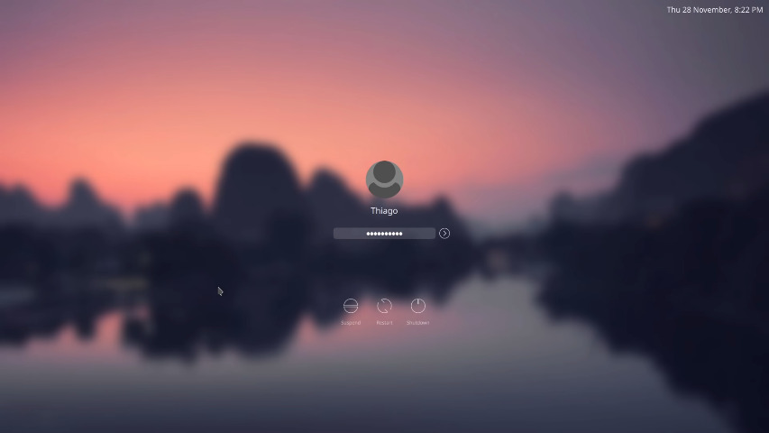

# ChillS

A simple and functional SDDM theme for KDE Plasma. Based on "[kde-plasma-chili](https://github.com/MarianArlt/kde-plasma-chili)".

In this version, some element has been adjusted for better user experience.

### Usage

Clone this repository then

```
$ sudo cp /ChillS /usr/share/sddm/themes
```
This will copy all the files to the themes directory of SDDM. After that you will have to point SDDM to the new theme by editing its config file:
```
$ sudo nano /usr/lib/sddm/sddm.conf.d/sddm.conf
```
In the `[Theme]` section set `Current=plasma-chili` or `Current=ChillS`. For a more detailed description please refer to the [Arch wiki on sddm](https://wiki.archlinux.org/index.php/SDDM). Note that, depending on your system setup, a duplicate configuration may exist in `/etc/sddm.conf`. Usually this path takes preference so you want to set the above line in this file if you have it.
